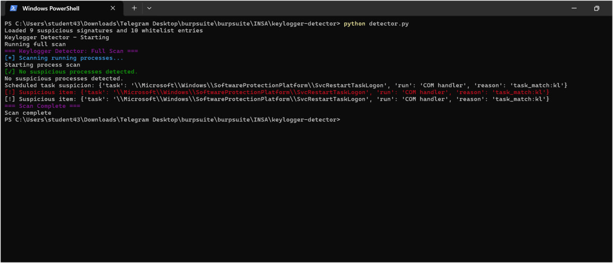

# Keylogger Detector

## Description

A Python-based tool to detect suspicious keylogging activity on Windows systems.  
It scans running processes, compares them against a whitelist and a suspicious list, and logs potential threats.

## Features

- Monitors running processes
- Detects suspicious behavior
- Logs results in the `logs/` folder
- Configurable whitelist and suspicious process list
- Unit tests available in `tests/`

## Project Structure

keylogger-detector/
│
├─ detector.py
├─ inspector.py
├─ notifier.py
├─ config.yaml
├─ suspicious_list.txt
├─ whitelist.txt
├─ requirements.txt
├─ README.md
├─ LICENSE
│
├─ logs/
│ └─ .gitkeep
│
└─ tests/
└─ test_inspector.py

## Installation

1. Clone the repository:

```bash
git clone https://github.com/raji12tata/keylogger-detector.git
cd keylogger-detector
```

2. (Optional) Create a virtual environment:

python -m venv venv
venv\Scripts\activate

3. Install dependencies:

pip install -r requirements.txt

4. Running the Detector

Run the main program:

python detector.py

5. Running Tests

Tests are located in the tests/ folder.

Run all tests using pytest:

pytest tests/

6. To view all logs together in PowerShell:

Get-Content .\logs\*.log

## Screenshots



## License

This project is licensed under the MIT License – see the LICENSE file for details.S
